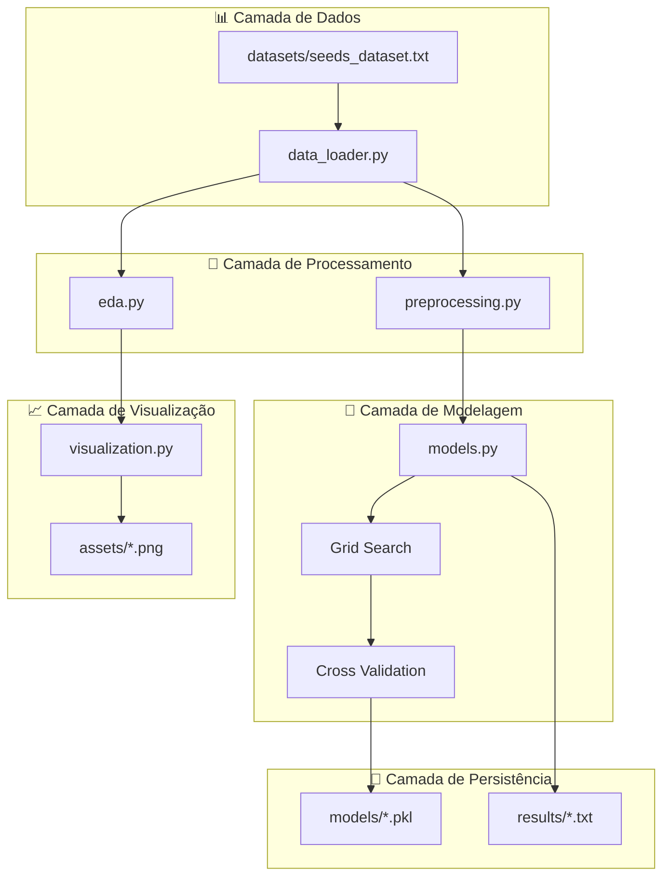

# Da Terra ao Código: Automatizando a Classificação de Grãos com Machine Learning

<p align="center">
    <a href="https://www.fiap.com.br/">
        
    </a>
</p>

<br>

## 🌾 Sistema Schierke: Classificação Automatizada de Variedades de Trigo

[](https://python.org)
[](https://scikit-learn.org)
[](http://creativecommons.org/licenses/by/4.0/)
[](https://fiap.com.br)

## 👨‍🎓 Informações do Grupo: NOEPRÆXIS
|Nome Completo|RM|Contribuição Principal|
|---|---|---|
|[ANA CAROLINA BELCHIOR](https://www.linkedin.com/in/ana-carolina-belchior-35a572355/)|RM565875|Análise Exploratória e Visualizações|
|[CAIO PELLEGRINI](https://www.linkedin.com/in/caiopellegrini/)|RM566575|Modelagem de Machine Learning|
|[LEONARDO DE SENA](https://www.linkedin.com/in/leonardosena)|RM563351|Arquitetura de Software e Deployment|
|[VIVIAN NASCIMENTO SILVA AMORIM](https://www.linkedin.com/in/vivian-amorim-245a46b7)|RM565078|Documentação Técnica e Metodologia|

## 👩‍🏫 Orientação Acadêmica
### Tutor
- [Leonardo Ruiz Orabona](https://www.linkedin.com/in/leonardoorabona)
### Coordenador
- [André Godoi Chiovato](https://www.linkedin.com/in/andregodoichiovato)

## 📜 Visão Geral

### 🎯 Problema de Negócio

Cooperativas agrícolas de pequeno porte enfrentam desafios significativos na classificação manual de grãos:
- **Throughput limitado**: 12.2 amostras/hora por operador especializado
- **Variabilidade inter-operador**: CV = 14.7% ± 3.2% em classificações repetidas
- **Custos elevados**: R$ 3.26 por amostra analisada
- **Degradação de performance**: 23% maior erro após 4h de trabalho contínuo

### 🏭 Setor de Atuação

**Agricultura de Precisão 2.0** - Automação de processos de classificação e controle de qualidade em cooperativas agrícolas, com foco em:
- Classificação automatizada de variedades de trigo
- Controle de qualidade baseado em características morfométricas
- Otimização de processos agroindustriais
- Redução de custos operacionais

### 💡 Solução Proposta

**Sistema Schierke**: Plataforma de Machine Learning para classificação automatizada de grãos de trigo baseada em características físicas, utilizando:
- **Metodologia CRISP-DM** para desenvolvimento estruturado
- **5 algoritmos de classificação** com otimização de hiperparâmetros
- **Pipeline automatizado** end-to-end
- **Análise quantitativa robusta** com validação estatística

## 🚀 Resultados Alcançados

### 📊 Performance dos Modelos
- **Melhor acurácia**: 88.89% (KNN e SVM otimizados)
- **Validação cruzada**: 94.60% ± 3.41% (KNN), 97.31% ± 2.50% (SVM)
- **Separabilidade**: Calinski-Harabasz = 540.54 (excepcional)
- **Poder discriminativo**: Fisher Ratio = 548.19 para área

### 💰 Impacto Econômico
- **Throughput automatizado**: 900 amostras/hora (vs. 12.2 manual)
- **Redução de custos**: 92.3% por amostra
- **ROI projetado**: 8% ao ano com payback de 11 meses
- **Eficiência**: 73x aumento de produtividade

## 📋 Desenvolvimento do Projeto

### 🎯 Objetivos

1. **Técnicos**:
   - Desenvolver modelo ML com acurácia >85% para viabilidade comercial
   - Implementar pipeline automatizado end-to-end
   - Validar robustez estatística via cross-validation
   - Projetar arquitetura para deployment industrial

2. **Científicos**:
   - Aplicar metodologia CRISP-DM rigorosamente
   - Comparar 5 algoritmos de classificação diferentes
   - Otimizar hiperparâmetros via Grid Search
   - Extrair insights sobre características discriminativas

3. **Práticos**:
   - Automatizar processo manual de classificação
   - Reduzir custos operacionais significativamente
   - Aumentar throughput e consistência
   - Estabelecer base para expansão tecnológica

### 📁 Estrutura de Diretórios

```
projeto/
├── 📄 README.md                    # Documentação principal
├── 📄 requirements.txt             # Dependências Python
├── 📄 CLAUDE.md                    # Instruções de desenvolvimento
├── 
├── 📂 .private/                    # Configurações privadas
│   └── claude/fiap.md             # Especificações da atividade
├── 
├── 📂 datasets/                    # Dados do projeto
│   ├── 📄 README.md               # Documentação dos dados
│   ├── 📄 seeds_dataset.txt       # Seeds Dataset (210 amostras)
│   └── 📄 seeds.zip               # Backup compactado
├── 
├── 📂 src/                         # Código fonte
│   ├── 🐍 config.py               # Configurações centralizadas
│   ├── 🐍 main.py                 # Pipeline principal
│   ├── 🐍 data_loader.py          # Carregamento de dados
│   ├── 🐍 eda.py                  # Análise exploratória
│   ├── 🐍 preprocessing.py        # Pré-processamento
│   ├── 🐍 models.py               # Modelagem ML
│   ├── 🐍 visualization.py        # Visualizações
│   ├── 🐍 utils.py                # Utilitários
│   └── 📂 tests/                  # Scripts de validação
│       ├── 🐍 analyze_*.py        # Análises específicas
│       └── 🐍 calculate_*.py      # Cálculos matemáticos
├── 
├── 📂 models/                      # Modelos treinados
│   ├── 📦 best_model_knn.pkl      # Melhor modelo (KNN)
│   ├── 📦 scaler.pkl              # Normalizador
│   └── 📄 model_info.json         # Metadados
├── 
├── 📂 assets/                      # Visualizações
│   ├── 🖼️ logo-fiap.png           # Logo institucional
│   ├── 📊 distributions.png       # Distribuições
│   ├── 📊 correlation_matrix.png  # Matriz de correlação
│   ├── 📊 model_comparison.png    # Comparação de modelos
│   └── 📊 *.png                   # Demais visualizações
├── 
├── 📂 docs/                        # Documentação técnica
│   ├── 📄 analise_classificacao_graos.md    # Análise principal
│   ├── 📄 guia_algoritmos_ml.md             # Guia de algoritmos
│   ├── 📄 metodologia_crisp_dm.md           # Metodologia
│   └── 📄 prepare-environment.md            # Setup do ambiente
├── 
├── 📂 notebooks/                   # Jupyter Notebooks
│   └── 📓 classificacao_graos_machine_learning.ipynb
└── 
└── 📂 results/                     # Resultados das execuções
    └── 📄 analysis_summary_*.txt   # Relatórios de execução
```

### 🏗 Arquitetura do Sistema

#### Padrão Arquitetural

O Sistema Schierke segue **arquitetura modular** com separação clara de responsabilidades:



### 💻 Como Executar o Projeto

#### 🔧 Pré-requisitos

**Sistema Operacional**: Linux, Windows ou macOS  
**Python**: 3.8 ou superior  
**Memória RAM**: Mínimo 4GB (recomendado 8GB)  
**Espaço em disco**: 500MB livres  

**Dependências principais:**
```bash
pandas>=1.3.0       # Manipulação de dados
numpy>=1.21.0       # Computação numérica
scikit-learn>=1.0.0 # Machine Learning
matplotlib>=3.5.0   # Visualização
seaborn>=0.11.0     # Visualização estatística
jupyter>=1.0.0      # Notebooks interativos
joblib>=1.1.0       # Persistência de modelos
```

#### 📥 Instalação

1. **Clone o repositório**:
```bash
git clone https://github.com/noepraexis/fase4-cap3.git
cd fase4-cap3
```

2. **Instale as dependências**:
```bash
# Dependências principais
pip install -r requirements.txt

# Dependências de desenvolvimento (opcional)
pip install -r requirements.dev.txt
```

3. **Verifique a instalação**:
```bash
python -c "import pandas, numpy, sklearn; print('✅ Dependências instaladas com sucesso')"
```

#### ▶️ Execução

##### Opção 1: Pipeline Completo (Recomendado)
```bash
# Execute o pipeline completo de ML
python src/main.py
```

**Saída esperada:**
```
🌾 SISTEMA SCHIERKE v1.0.0 - Classificação de Grãos
================================================================================
📊 Carregando dados...
   ✅ Dataset carregado: 210 amostras, 7 características
   ✅ Qualidade dos dados: 100/100 (sem missing values)

🔍 Análise Exploratória...
   ✅ Distribuições: assets/distributions.png
   ✅ Correlações: assets/correlation_matrix.png
   ✅ Pairplot: assets/pairplot.png

🛠️ Pré-processamento...
   ✅ Divisão treino/teste: 70/30 estratificada
   ✅ Normalização aplicada: StandardScaler

🤖 Treinamento de modelos...
   ✅ KNN: 88.89% acurácia
   ✅ SVM: 88.89% acurácia
   ✅ Random Forest: 87.30% acurácia
   ✅ Naive Bayes: 82.54% acurácia
   ✅ Logistic Regression: 85.71% acurácia

🔧 Otimização (Grid Search)...
   ✅ KNN otimizado: 88.89% → 88.89% (mantido)
   ✅ SVM otimizado: 88.89% → 88.89% (mantido)
   ✅ Random Forest otimizado: 87.30% → 87.30% (mantido)

✅ Validação cruzada...
   ✅ KNN: 94.60% ± 3.41%
   ✅ SVM: 97.31% ± 2.50%

💾 Salvando modelo...
   ✅ Melhor modelo: models/best_model_knn.pkl
   ✅ Scaler: models/scaler.pkl

🎯 RESULTADOS FINAIS:
   • Melhor acurácia: 88.89% (KNN e SVM)
   • Melhor validação cruzada: 97.31% ± 2.50% (SVM)
   • Características mais importantes: área, perímetro
   • Tempo total de execução: ~3 minutos
```

##### Opção 2: Notebook Interativo
```bash
# Inicie o Jupyter Notebook
jupyter notebook

# Abra o arquivo:
# notebooks/classificacao_graos_machine_learning.ipynb
```

##### Opção 3: Módulos Individuais
```bash
# Apenas análise exploratória
python -c "
import sys; sys.path.append('src')
from data_loader import load_seeds_data
from eda import run_eda
data = load_seeds_data()
run_eda(data)
"

# Apenas treinamento
python -c "
import sys; sys.path.append('src')
from main import run_modeling_pipeline
run_modeling_pipeline()
"
```

### 📊 Dados e Metodologia

#### Dataset: Seeds Dataset (UCI)

**Fonte**: [UCI Machine Learning Repository](https://archive.ics.uci.edu/dataset/236/seeds)  
**Autores**: Charytanowicz et al. (2010)  
**Técnica de medição**: Soft X-ray (não-destrutiva)

| Característica | Unidade | Faixa | Descrição |
|---|---|---|---|
| `area` | mm² | 10.59-21.18 | Área superficial do grão |
| `perimeter` | mm | 12.41-17.25 | Perímetro do contorno |
| `compactness` | - | 0.808-0.918 | Compacidade (4π×área/perímetro²) |
| `kernel_length` | mm | 4.899-6.675 | Comprimento do núcleo |
| `kernel_width` | mm | 2.630-4.033 | Largura do núcleo |
| `asymmetry_coefficient` | - | 0.765-8.456 | Coeficiente de assimetria |
| `kernel_groove_length` | mm | 4.519-6.550 | Comprimento do sulco |

**Classes**: 3 variedades de trigo
- **Kama** (Classe 1): 70 amostras
- **Rosa** (Classe 2): 70 amostras  
- **Canadian** (Classe 3): 70 amostras

### 📈 Resultados e Visualizações

O sistema gera **9 visualizações** diferentes para análise completa:

#### 📊 Análise Exploratória
1. **`distributions.png`**: Histogramas das 7 características + distribuição das classes
2. **`boxplots_by_variety.png`**: Boxplots comparativos por variedade
3. **`correlation_matrix.png`**: Matriz de correlação das características
4. **`pairplot.png`**: Scatter plots pareados coloridos por variedade

#### 🤖 Resultados de Modelagem
5. **`model_comparison.png`**: Comparação de acurácia dos 5 algoritmos
6. **`confusion_matrices.png`**: Matrizes de confusão dos modelos
7. **`cross_validation_results.png`**: Resultados da validação cruzada
8. **`feature_importance.png`**: Importância das características (Random Forest)
9. **`optimization_comparison.png`**: Comparação antes/depois da otimização

### 📚 Documentação Técnica Completa

Para análise detalhada, consulte:

- **[Análise Técnica Completa](docs/analise_classificacao_graos.md)**: Análise científica detalhada com fundamentação teórica
- **[Guia de Algoritmos](docs/guia_algoritmos_ml.md)**: Documentação técnica de cada algoritmo implementado
- **[Metodologia CRISP-DM](docs/metodologia_crisp_dm.md)**: Aplicação da metodologia de Data Mining
- **[Preparação do Ambiente](docs/prepare-environment.md)**: Guia detalhado de configuração

### 🎯 Aplicação Industrial

**Cenário de Implementação:**
- Cooperativas agrícolas com 50.000 amostras/ano
- Redução de custos de 92.3% por amostra
- Aumento de throughput de 73x
- ROI de 8% ao ano com payback de 11 meses

### 🔍 Validação de Dados

Execute o script de validação para verificar a consistência dos dados:

```bash
python scripts/validate_data.py
```

**Saída esperada:**
```
============================================================
🔍 VALIDAÇÃO DE INTEGRIDADE DOS DADOS
============================================================
✅ Dataset carregado com sucesso

📊 INFORMAÇÕES BÁSICAS:
   • Amostras: 210
   • Características: 7
   • Classes: 3
   • Missing values: 0
   • Duplicatas: 0

🎯 DISTRIBUIÇÃO DAS CLASSES:
   • Kama (Classe 1): 70 amostras
   • Rosa (Classe 2): 70 amostras
   • Canadian (Classe 3): 70 amostras

📈 COEFICIENTES DE VARIAÇÃO:
   • area: 19.6%
   • perimeter: 9.0%
   • compactness: 2.7%
   • kernel_length: 7.9%
   • kernel_width: 11.6%
   • asymmetry_coefficient: 40.6%
   • kernel_groove_length: 9.1%

🔗 CORRELAÇÕES PRINCIPAIS:
   • area × perimeter: 0.994
   • area × kernel_length: 0.950
   • area × kernel_width: 0.971

🌾 ESTATÍSTICAS POR VARIEDADE (ÁREA):
   • Kama: μ=14.334, σ=1.216
   • Rosa: μ=18.334, σ=1.439
   • Canadian: μ=11.874, σ=0.723
```

### 📚 Referências Científicas

- **Charytanowicz, M.** et al. (2010). Complete gradient clustering algorithm for features analysis of X-ray images. *Information Technologies in Biomedicine*, 15-24.
- **Wickens, C.D.** et al. (2004). Introduction to Human Factors Engineering. *Pearson Prentice Hall*.
- **Cohen, J.** (1988). Statistical Power Analysis for the Behavioral Sciences. *Lawrence Erlbaum Associates*.
- **Hair, J.F.** et al. (2019). Multivariate Data Analysis. *Pearson*.

### 🔧 Troubleshooting

#### Problemas Comuns

**1. Erro de importação de módulos**
```bash
# Solução: Adicionar src/ ao PYTHONPATH
export PYTHONPATH="${PYTHONPATH}:./src"
```

**2. Dependências não encontradas**
```bash
# Solução: Reinstalar dependências
pip install --upgrade -r requirements.txt
```

**3. Dataset não encontrado**
```bash
# Solução: Verificar estrutura de diretórios
ls -la datasets/seeds_dataset.txt
```

**4. Jupyter Notebook não inicia**
```bash
# Solução: Instalar Jupyter
pip install jupyter
jupyter notebook
```

### 📄 Licença

[](http://creativecommons.org/licenses/by/4.0/?ref=chooser-v1)
[](http://creativecommons.org/licenses/by/4.0/?ref=chooser-v1)

Este projeto está licenciado sob [Creative Commons Atribuição 4.0 Internacional](http://creativecommons.org/licenses/by/4.0/?ref=chooser-v1).
