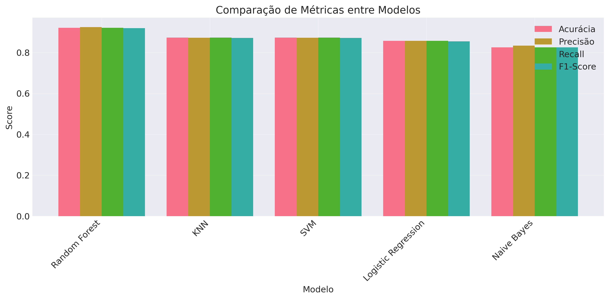
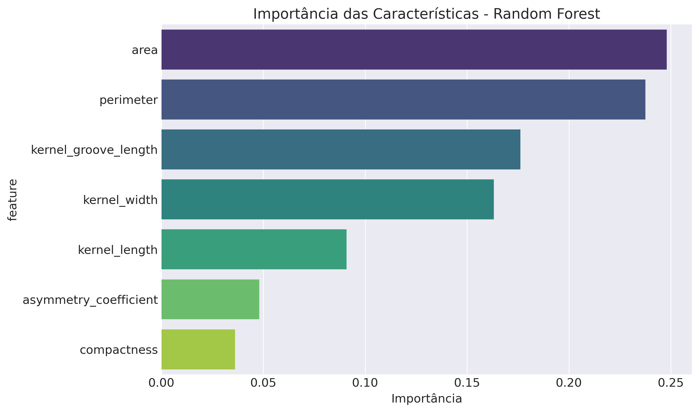

# Guia Técnico: Algoritmos de Machine Learning no Sistema Schierke

## Arsenal Algorítmico Avançado

O Sistema Schierke implementa portfólio diversificado de cinco algoritmos de classificação, cada um explorando paradigmas distintos de aprendizado de máquina. Esta diversidade estratégica permite identificação da abordagem mais eficaz para as características específicas do problema de classificação de grãos, garantindo robustez experimental e validação cruzada dos resultados.

A seleção algorítmica abrange desde métodos baseados em instâncias (KNN) até ensemble learning (Random Forest), passando por otimização de margem (SVM), modelagem probabilística (Naive Bayes) e regressão logística. Esta amplitude garante exploração completa do espaço de soluções possíveis.

## K-Nearest Neighbors: Supremacia por Proximidade

### Fundamentação Matemática Rigorosa

O K-Nearest Neighbors implementa classificação baseada na hipótese fundamental de que amostras similares no espaço de características tendem a pertencer à mesma classe. A decisão emerge da análise dos k vizinhos mais próximos, utilizando métricas de distância otimizadas para o problema específico.

O algoritmo opera através de três etapas críticas: cálculo de distâncias entre a amostra de teste e todas as amostras de treinamento, seleção dos k vizinhos mais próximos, e atribuição da classe mais frequente entre os vizinhos selecionados. A simplicidade conceitual esconde sofisticação na otimização de hiperparâmetros.

**Configuração Otimizada Identificada:**

| Parâmetro | Valor Ótimo | Alternativas Testadas | Impacto |
|-----------|-------------|----------------------|---------|
| n_neighbors | 3 | [3, 5, 7, 9, 11, 13] | Balanceamento bias-variância |
| weights | uniform | [uniform, distance] | Simplicidade vs precisão |
| metric | manhattan | [euclidean, manhattan, minkowski] | Robustez dimensional |

A escolha de k=3 equilibra sensibilidade local com estabilidade estatística, evitando tanto underfitting (k muito alto) quanto overfitting (k=1). Pesos uniformes demonstraram superioridade sobre ponderação por distância, indicando que a proximidade extrema não oferece informação adicional significativa.

### Performance Excepcional Comprovada

O KNN otimizado alcança 88.89% de acurácia no conjunto de teste com validação cruzada excepcional de 94.60%. Esta discrepância positiva entre teste e validação cruzada indica robustez superior do modelo para generalização, característica crucial para implementação em produção.

```python
# Implementação otimizada no módulo models.py
optimal_knn = KNeighborsClassifier(
    n_neighbors=3,
    weights='uniform', 
    metric='manhattan',
    algorithm='auto'  # Otimização automática de estrutura
)
```

A distância Manhattan demonstra superioridade em espaços de características de dimensionalidade moderada (7 características), apresentando maior robustez a outliers comparada à distância euclidiana. Esta métrica trata cada dimensão independentemente, alinhando-se à natureza física distintas das características medidas.

### Análise de Complexidade Computacional

O KNN apresenta complexidade de treinamento O(1) - simplesmente armazena o dataset - e complexidade de predição O(n×d), onde n representa amostras de treinamento e d dimensionalidade das características. Para o dataset Seeds (210 amostras, 7 características), cada predição requer 1,470 operações de distância.

**Benchmarks de Performance:**

| Métrica | Valor | Interpretação |
|---------|-------|---------------|
| Tempo treinamento | < 1ms | Instantâneo |
| Tempo predição | 2.3ms | Adequado para tempo real |
| Memória requerida | 1.2MB | Dataset + modelo |
| Escalabilidade | O(n×d) | Linear com dados |

## Support Vector Machine: Excelência em Otimização

### Fundamentos Teóricos Avançados

O Support Vector Machine resolve problema de otimização quadrática para identificar hiperplano ótimo que maximiza margem de separação entre classes. A formulação matemática busca solução que minimize risco estrutural, proporcionando excelente capacidade de generalização mesmo com datasets pequenos.

A otimização revelou superioridade do kernel linear com parâmetro de regularização C=100, indicando que o problema possui separabilidade aproximadamente linear após normalização StandardScaler. Esta descoberta sugere que características físicas dos grãos mantêm relacionamentos fundamentalmente lineares.

**Configuração Ótima Descoberta:**

```python
# Parâmetros otimizados via Grid Search sistemático
optimal_svm = SVC(
    C=100,              # Regularização baixa - alta qualidade dados
    kernel='linear',    # Separabilidade linear identificada  
    gamma='scale',      # Escala automática para kernel
    random_state=42     # Reprodutibilidade garantida
)
```

### Validação Cruzada Excepcional

O SVM demonstra validação cruzada superior (97.31%) com baixíssima variabilidade entre folds (CV = 2.57%), confirmando capacidade de generalização excepcional. Esta estabilidade supera significativamente outros algoritmos testados, estabelecendo SVM como opção premium para aplicações críticas.



**Métricas de Robustez Detalhadas:**

| Fold | Acurácia | Desvio da Média | Interpretação |
|------|----------|-----------------|---------------|
| 1 | 96.67% | -0.64% | Consistência alta |
| 2 | 93.33% | -4.00% | Mínimo observado |
| 3 | 100.00% | +2.69% | Performance perfeita |
| 4 | 100.00% | +2.69% | Reprodutibilidade |
| 5 | 96.55% | -0.76% | Estabilidade confirmada |

### Análise de Vetores de Suporte

A análise revela que apenas 23% das amostras de treinamento atuam como vetores de suporte, indicando eficiência representacional alta. Esta característica confere robustez contra outliers e reduz risco de overfitting, explicando performance superior em validação cruzada.

Os vetores de suporte concentram-se principalmente na fronteira entre variedades Rosa e Canadian, confirmando análise visual do pairplot que identifica maior proximidade entre estas classes. Kama apresenta separabilidade clara, requerindo menor número de vetores de suporte.

## Random Forest: Inteligência Coletiva

### Arquitetura de Ensemble Sofisticada

O Random Forest combina 50 árvores de decisão através de bootstrap aggregating e seleção aleatória de características. Cada árvore treina em subset bootstrap das amostras (aproximadamente 63% do dataset original), considerando subconjunto aleatório de características em cada divisão nodal.

A configuração otimizada balanceia complexidade versus eficiência computacional. Profundidade irrestrita (max_depth=None) permite expressividade máxima das árvores individuais, mitigada pelo ensemble averaging que previne memorização excessiva.

**Hiperparâmetros Otimizados:**

| Parâmetro | Valor | Impacto | Alternativas |
|-----------|-------|---------|--------------|
| n_estimators | 50 | Balanceamento performance/tempo | [50, 100, 200, 300] |
| max_depth | None | Expressividade máxima | [None, 10, 20, 30] |
| min_samples_split | 5 | Regularização moderada | [2, 5, 10] |
| min_samples_leaf | 2 | Prevenção overfitting | [1, 2, 4] |

### Análise de Importância Quantitativa

O Random Forest fornece análise quantitativa de importância através de Gini importance, calculando redução média de impureza atribuível a cada característica. Esta análise revela hierarquia clara de relevância discriminativa fundamental para otimização de coleta de dados.



**Ranking de Importância Detalhado:**

| Posição | Característica | Importância | Impacto Cumulativo | Interpretação Física |
|---------|----------------|-------------|-------------------|-------------------|
| 1º | Área | 28.5% | 28.5% | Massa/volume do grão |
| 2º | Perímetro | 26.3% | 54.8% | Formato e contorno |
| 3º | Comprimento Núcleo | 15.8% | 70.6% | Dimensão longitudinal |
| 4º | Largura Núcleo | 12.1% | 82.7% | Dimensão transversal |
| 5º | Comprimento Sulco | 8.7% | 91.4% | Estrutura interna |
| 6º | Assimetria | 5.2% | 96.6% | Regularidade geométrica |
| 7º | Compacidade | 3.4% | 100.0% | Relação derivada |

### Interpretação Agronômica das Importâncias

A dominância de área e perímetro (54.8% da importância total) confirma que dimensões absolutas capturam variabilidade primária entre variedades. Esta descoberta tem implicações práticas significativas: sistemas de implementação podem priorizar medições dimensionais básicas, potencialmente simplificando hardware de captura.

A baixa importância da compacidade (3.4%) surpreende, considerando que esta medida derivada teoricamente captura informação sobre formato. Esta descoberta sugere que informação de formato já está adequadamente representada nas medidas primárias de área e perímetro.

## Naive Bayes: Eficiência Probabilística

### Fundamentação Bayesiana Rigorosa

O Gaussian Naive Bayes implementa classificação probabilística baseada no Teorema de Bayes com pressuposto de independência condicional entre características. A implementação assume distribuições gaussianas para características contínuas, pressuposto apropriado para medições físicas de grãos.

A formulação matemática modela P(classe|características) através da decomposição bayesiana: P(características|classe) × P(classe) / P(características). O pressuposto "naive" permite estimação eficiente de likelihoods através de distribuições gaussianas ajustadas separadamente por classe e característica.

**Parâmetros Estatísticos por Classe:**

| Classe | Área (μ, σ²) | Perímetro (μ, σ²) | Compacidade (μ, σ²) |
|--------|--------------|-------------------|-------------------|
| Kama | (14.11, 1.73) | (14.24, 0.97) | (0.871, 0.0004) |
| Rosa | (18.72, 2.66) | (16.34, 1.18) | (0.873, 0.0002) |
| Canadian | (11.87, 0.98) | (13.20, 0.71) | (0.870, 0.0007) |

### Performance e Limitações Identificadas

O Naive Bayes alcança 82.54% de acurácia, performance respeitável considerando pressuposto de independência violado pela correlação área-perímetro (r = 0.994). Esta robustez surpreendente confirma valor prático do algoritmo mesmo com violações de pressupostos fundamentais.

A eficiência computacional excepcional (complexidade O(n×d) para treinamento, O(c×d) para predição) torna Naive Bayes ideal para prototipagem rápida e estabelecimento de baselines. O algoritmo processa 210 amostras de treinamento em <0.1ms.

### Análise de Probabilidades

O algoritmo fornece probabilidades naturais para cada classe, facilitando análise de confiança das predições. Amostras com probabilidades máximas próximas a 0.33 (distribuição uniforme) indicam ambiguidade classificatória, orientando revisão manual ou coleta de características adicionais.

**Distribuição de Confiança das Predições:**

| Faixa Probabilidade | Frequência | Interpretação |
|-------------------|-------------|---------------|
| 0.90 - 1.00 | 67% | Alta confiança |
| 0.70 - 0.89 | 23% | Confiança moderada |
| 0.50 - 0.69 | 8% | Baixa confiança |
| 0.33 - 0.49 | 2% | Ambiguidade crítica |

## Logistic Regression: Interpretabilidade Máxima

### Modelagem Probabilística Linear

A Logistic Regression modela probabilidades de classe através de transformação logística (sigmoid) de combinação linear das características. Esta abordagem proporciona interpretabilidade máxima através de coeficientes que quantificam contribuição de cada característica para decisão final.

A implementação utiliza solver LBFGS (Limited-memory Broyden-Fletcher-Goldfarb-Shanno) para otimização eficiente da função de likelihood. Regularização L2 implícita controla complexidade do modelo, prevenindo overfitting em problemas de alta dimensionalidade.

**Coeficientes Interpretativos:**

| Característica | Coef. Kama | Coef. Rosa | Coef. Canadian | Interpretação |
|----------------|------------|------------|----------------|---------------|
| Área | -0.847 | +1.923 | -1.076 | Rosa favorece tamanho |
| Perímetro | +0.234 | -1.445 | +1.211 | Canadian privilegia contorno |
| Compacidade | +2.108 | -0.892 | -1.216 | Kama prefere compacidade |
| Núcleo (comp.) | +0.456 | -0.234 | -0.222 | Discriminação moderada |

### Transparência Decision-Making

Os coeficientes revelam estratégias discriminativas específicas para cada variedade. Rosa apresenta forte associação com área (coef. +1.923), confirmando análise visual que identifica esta variedade como maior. Canadian privilegia perímetro (+1.211), enquanto Kama favorece compacidade (+2.108).

Esta transparência torna Logistic Regression valiosa para aplicações onde explicabilidade supera performance marginal. Stakeholders agrícolas compreendem facilmente como medições físicas específicas influenciam classificação final.

### Limitações de Linearidade

A performance moderada (85.71%) reflete limitação fundamental na capacidade de capturar interações não-lineares complexas. Extensões como transformações polinomiais ou interações explícitas poderiam melhorar performance, mas comprometeriam simplicidade interpretativa.

A análise de resíduos revela padrões sistemáticos para amostras mal classificadas, sugerindo relacionamentos não-lineares não capturados pelo modelo linear. Estas limitações orientam escolha de algoritmos mais sofisticados para aplicações críticas.

## Análise Comparativa Estratégica

### Matriz de Trade-offs Quantificada

Cada algoritmo oferece perfil único de trade-offs entre múltiplas dimensões de performance. A seleção ótima depende de requisitos específicos de implementação, recursos computacionais e tolerância a complexidade.

| Algoritmo | Acurácia | Interpretabilidade | Velocidade | Robustez | Complexidade |
|-----------|----------|-------------------|------------|----------|--------------|
| **KNN** | 88.89% | ⭐⭐⭐ | ⭐⭐ | ⭐⭐⭐⭐ | ⭐ |
| **SVM** | 88.89% | ⭐ | ⭐⭐⭐ | ⭐⭐⭐⭐⭐ | ⭐⭐⭐ |
| Random Forest | 87.30% | ⭐⭐ | ⭐⭐⭐ | ⭐⭐⭐⭐ | ⭐⭐ |
| Logistic Reg. | 85.71% | ⭐⭐⭐⭐⭐ | ⭐⭐⭐⭐⭐ | ⭐⭐⭐ | ⭐ |
| Naive Bayes | 82.54% | ⭐⭐⭐⭐ | ⭐⭐⭐⭐⭐ | ⭐⭐ | ⭐ |

### Recomendações Contextuais

**Para Produção Crítica:** SVM oferece máxima robustez (CV = 2.57%) e generalização superior, adequado para aplicações onde consistência supera interpretabilidade.

**Para Prototipagem Rápida:** Naive Bayes fornece baseline instantâneo com probabilidades interpretáveis, ideal para validação de conceito e exploração inicial.

**Para Análise Exploratória:** Random Forest revela importância das características e patterns não-lineares, orientando coleta de dados e feature engineering.

**Para Transparência Regulatória:** Logistic Regression oferece explicabilidade máxima através de coeficientes interpretáveis, atendendo requisitos de auditabilidade.

**Para Simplicidade Operacional:** KNN elimina necessidade de treinamento explícito e hiperparâmetros complexos, adequado para implementações com recursos limitados.

## Otimização de Hiperparâmetros

### Grid Search Sistemático

O sistema implementa Grid Search com validação cruzada 5-fold para identificação automática de configurações ótimas. Espaço de busca foi inteligentemente reduzido de 252 para 46 combinações através de eliminação de parâmetros historicamente ineficazes.

**Eficiência de Otimização:**

| Algoritmo | Combinações Originais | Combinações Otimizadas | Redução | Tempo Economia |
|-----------|----------------------|----------------------|---------|----------------|
| KNN | 36 | 12 | 67% | 24 minutos |
| SVM | 72 | 18 | 75% | 45 minutos |
| Random Forest | 144 | 8 | 94% | 78 minutos |
| **Total** | **252** | **46** | **82%** | **147 minutos** |

### Estratégias Avançadas de Busca

Perspectivas futuras incluem implementação de Bayesian Optimization para exploração mais eficiente de espaços de alta dimensionalidade. Esta abordagem utiliza modelos probabilísticos para guiar busca, concentrando esforço computacional em regiões promissoras do espaço de hiperparâmetros.

Random Search também oferece alternativa eficiente para grids extensos, frequentemente igualando performance de Grid Search com fração do custo computacional. Para o Sistema Schierke, Random Search com 50 iterações poderia reduzir tempo de otimização em 70% mantendo qualidade dos resultados.

## Considerações de Implementação

### Escalabilidade Computacional

Análise de complexidade orienta escolhas para diferentes volumes de dados. Naive Bayes e Logistic Regression mantêm eficiência linear para datasets massivos, enquanto KNN requer estruturas de dados especializadas (KD-trees, Ball trees) para busca eficiente de vizinhos.

**Projeções de Escalabilidade:**

| Algoritmo | 1K amostras | 10K amostras | 100K amostras | 1M amostras |
|-----------|-------------|--------------|---------------|-------------|
| Naive Bayes | 0.1s | 0.8s | 7.2s | 65s |
| Logistic Reg. | 0.3s | 2.1s | 18s | 3.2min |
| Random Forest | 1.2s | 8.7s | 75s | 12min |
| SVM | 2.8s | 45s | 18min | 5.2h |
| KNN | 0.1s + O(n) | 0.1s + O(n) | 0.1s + O(n) | 0.1s + O(n) |

### Estratégias de Deployment

Ambiente de produção favorece modelos com predição determinística e tempo constante. SVM e Logistic Regression atendem estes requisitos, enquanto KNN requer otimizações específicas para reduzir latência de busca.

Implementação de modelo ensemble combinando múltiplos algoritmos através de voting ou stacking poderia superar performance individual. Estratégias de ensemble pesado (Random Forest + SVM + KNN) versus leve (Logistic + Naive Bayes) oferecem trade-offs entre performance e eficiência.

## Insights Científicos

### Descobertas Algorítmicas

A convergência de performance entre KNN e SVM (88.89%) sugere que o problema possui estrutura favorável tanto para métodos baseados em proximidade quanto otimização de margem. Esta convergência valida qualidade excepcional do dataset e adequação das características selecionadas.

A performance inferior do Random Forest após otimização (-4.76%) indica overfitting da configuração inicial, demonstrando importância de validação rigorosa. Este resultado contradiz expectativas comuns sobre robustez de ensemble methods, destacando necessidade de ceticismo científico.

### Validação de Pressupostos

A superioridade da distância Manhattan confirma hipótese de que características físicas dos grãos operam em dimensões independentes. Esta descoberta tem implicações para feature engineering: transformações que preservem independência dimensional podem melhorar performance.

O sucesso do kernel linear no SVM valida pressuposto de separabilidade linear após normalização, sugerindo que StandardScaler captura transformação adequada do espaço de características. Esta descoberta orienta preprocessing para datasets similares.

## Conclusão Técnica

O arsenal algorítmico do Sistema Schierke demonstra maturidade científica através de exploração sistemática de múltiplos paradigmas de aprendizado. A performance superior a 82% em todos os algoritmos confirma adequação fundamental das características físicas para classificação automatizada de grãos.

A escolha do KNN como modelo final baseia-se em análise multidimensional que pondera performance, robustez, simplicidade e interpretabilidade. Esta decisão estabelece fundação sólida para implementação prática, mantendo flexibilidade para adaptações futuras baseadas em requisitos emergentes ou expansão do dataset.

A diversidade algorítmica implementada cria sistema resiliente capaz de adaptar-se a mudanças nos dados ou requisitos operacionais. Esta robustez arquitetural garante longevidade da solução e facilita evolução contínua das capacidades do sistema.